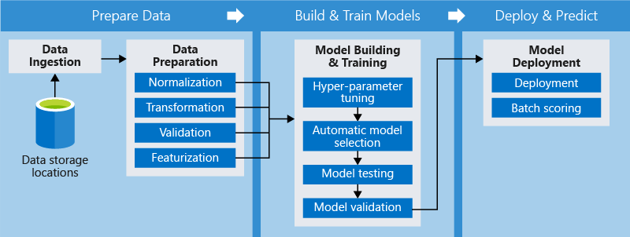

# Azure ML Workshop :test_tube: 

## Contents
1. [Getting started](#getting_started)
2. [Compute instance](#compute-instance)  
    i.  [Create a compute instance](#create-a-compute-instance)
    ii. [Clone repo into compute instance](#clone-repo-into-compute-instance)
3. [Datasets](#datasets)
    i. [Creating a dataset](#creating-a-dataset)
4. [Train and register models](#train-and-register-models)
5. [Pipeline](#pipeline)
    i.  [Why build pipelines?](#why-build-pipelines?)
    ii. [Creating a pipeline](#creating-a-pipeline)
6. [Train from local machine](#train-from-local-machine)
7. [Clean up](#clean-up)

## Getting started
1. Login to the [Azure Portal](https://portal.azure.com/)
2. Check that `AI Studentlab` is available in *Subscription*
3. Go to *Resources* and choose `ml_aisl`
4. Click **Launch Now** to go to Azure Machine Learning studio. Alternatively you can open [Azure Machine Learning studio](https://ml.azure.com), where you need to sign with the following selected:  
    * **Directory**: Skatteetaten
    * **Subscription**: AI Studentlab
    * **Machine Learning workspace**: ml-aisl

Feel free to explore Azure ML Studio.

> :information_source: If you are prompted to sign in on the way in this workshop, use your Microsoft account associated with your Azure subscription to sign back in.

## Compute instance
**TODO: Explenation here**


### Create a compute instance
1. In [Azure ML studio](https://ml.azure.com/), navigate to *Compute* and chose *Compute instances*. Then create a **new** compute instance.
2. Fill in the following:  
    * **Compute name**: <your_name>workshop
    * **Region**: westeurope 
    * **Virtual machine type**: CPU (Central Processing Unit)
    * **Virtual machine size**: Standard D1

> :warning: You need to provide the correct information otherwise you may encounter problems later in this workshop.

3. Make sure your information is correct before you click **create**.
4. For the next steps see section [Clone repo into compute instance](#clone-repo-into-compute-instance).

### Clone repo into compute instance
> :information_source: When we work with compute instances we need to make ..

1. In [Azure Machine Learning studio](https://ml.azure.com/), on the **Compute** page for your workspace, view the **Compute Instances** tab, and if necessary, click **Refresh** periodically until the compute instance you created in has started.
2. Click your compute instance's Jupyter link to open **Jupyter** Notebooks in a new tab.
3. In the notebook environment, create a new **Terminal**. This will open a new tab with a command shell.
4. The Azure Machine Learning SDK is already installed in the compute instance image, but it's worth ensuring you have the latest version, with the optional packages you'll need in this workshop. Enter the following command to update the SDK packages:
```sh
pip install --upgrade azureml-sdk[notebooks,automl,explain]
```
You may see some warnings as the package dependencies are installed, but you can ignore these.

5. Next, run the following commands to change the current directory to the Users directory, and retrieve the notebooks you will use in the workshop:
```sh
cd Users
git clone https://github.com/claesgill/azure_ml_workshop
```
6. After the command has completed, close the terminal tab and view the home page in your Jupyter notebook file explorer. Then open the `Users` folder and go to `azure_ml_workshop` folder. Here you should have everything you need to continue this workshop.
7. Open the `1_testing_workspace.ipynb` notebook. Then read all the notes in the notebook, and run each code cell in turn. 
8. When you have finished running the code in the notebook, on the **File** menu, click **Close and Halt** to close it and shut down its Python kernel.

## Datasets
> :information_source: Working with machine learning usually requires big chunks of data, and Azure ML provides multiple datastores for our usage. Your Azure ML workspace already includes two datastores based on the Azure Storage account that was created along with the workspace. These are used to store notebooks, configuration files and data. Where datasets represent specific data files or tables that you plan to work with in Azure ML.
> In [Azure ML studio](https://ml.azure.com/), navigate to the **Datastores** page to see the available datastores.

### Creating a dataset
1. In [Azure ML studio](https://ml.azure.com/), navigate to the **Datasets** page.
2. Create a **new** dataset from **web files**, using the following settings:
    * **Basic Info**:
        - **Web URL**: [https://aka.ms/diabetes-data](https://aka.ms/diabetes-data)
        - **Name**: diabetes dataset (be careful to match the case and spacing)
        - **Dataset type**: Tabular
        - **Description**: Diabetes data
    * **Settings and preview**:
        - **File format**: Delimited
        - **Delimiter**: Comma
        - **Encoding**: UTF-8
        - **Column headers**: Use headers from first file
        - **Skip rows**: None
    * **Schema**:
        - Include all columns other than Path
        - Review the automatically detected types
    * **Confirm details**:
        - Do **not** profile the dataset after creation
3. After the dataset has been created, you can open it to see a sample of the data. Click the **diabetes dataset** and go to the **Explore** tab. The data represents details from patients who have been tested for diabetes, and is the dataset we will use in this workshop.

~~4. Go and run notebook `2_fetch_dataset.ipynb` to see the data frames?~~

## Train and register models
> :information_source: In this task, you'll use code in a notebook to run training scripts as Azure Machine Learning experiments.

1. In [Azure ML studio](https://ml.azure.com/), navigate to the **Compute** page and on the **Compute Instances** tab, verify that your compute instance is running.
2. When the compute instance is running, click the *Jupyter* link to open the Jupyter home page in a new browser tab.
3. In the Jupyter home page, go to the `Users/azure_ml_workshop` folder and open the `2_training_models.ipynb` notebook. Then read all the notes in the notebook, and run each code cell in turn.
4. When you have finished running the code in the notebook, on the **File** menu, click **Close and Halt** to close it and shut down its Python kernel.

## Pipeline

### Why build pipelines?
With pipelines, you can optimize your workflow with simplicity, speed, portability, and reuse. Breaking it down to independent steps allow multiple data scientists to work on the same pipeline at the same time.

Using distinct steps makes it possible to rerun only the steps you need as you tweak and test your workflow. Once the pipeline is designed, there is often more fine-tuning around the training loop of the pipeline. When you rerun a pipeline, the execution jumps to the steps that need to be rerun, such as an updated training script, and skips what hasn't changed. The same paradigm applies to unchanged scripts and metadata.

With Azure ML, you can use distinct toolkits and frameworks for each step in your pipeline. Azure coordinates between the various compute targets you use so that your intermediate data can be shared with the downstream compute targets easily. The following figure illustrates a pipeline.



An Azure ML pipeline is an independently executable workflow of a complete machine learning task. Subtasks are encapsulated as a series of steps within the pipeline. An Azure ML pipeline can be as simple as one that calls a Python script, so may do just about anything.

A typical pipeline contains:
* Data preparation (download dataset, normalize ++)
* Training configuration (arguments, parameters ++)
* Training and validating 
* Deployment, including versioning, scaling, provisioning, and access control

### Creating a pipeline
In this task, you'll create a pipeline to train and register a model.

What we want to achieve in this is .... *TODO*

1. In [Azure ML studio](https://ml.azure.com/), navigate to the **Compute** page and on the **Compute Instances** tab, verify that your compute instance is running.
2. When the compute instance is running, click the *Jupyter* link to open the Jupyter home page in a new browser tab.
3. In the Jupyter home page, go to the `Users/azure_ml_workshop` folder and open the `3_creating_pipeline.ipynb` notebook. Then read all the notes in the notebook, and run each code cell in turn.
4. When you have finished running the code in the notebook, on the **File** menu, click **Close and Halt** to close it and shut down its Python kernel.

## Train from local machine
*TODO*
### Requirements
* Python v3.6.9 or higher
* pip3
```sh
pip3 install -r requirements.txt
```

## Clean up
When you are finished with the workshop it is important that you shut down all compute instances and compute clusters since this is a pay-as-you-go service.

1. In [Azure ML studio](https://ml.azure.com/), navigate to the **Compute** page and on the **Compute Instances** tab choose your compute instanse and click **Stop** to shut it down.
2. In [Azure ML studio](https://ml.azure.com/), navigate to the **Compute** page and on the **Compute clusters** tab choose your compute instanse and click **Stop** to shut it down.

Lastly we will thank you for your participation and if you had problems following this workshop or have suggestion for a change please file a [issue](/issue).

## TODO
* [x] Please file a [issue](#issues) if you had problems following this workshop or have suggestion for change
* [x] Fill in Creatin pipeline
* [x] Fill in Train from local machine
* [x] Notebook for Pipeline
* [x] Notebook for Train and register models
* [x] Need to mention that compute instance and cluster must be shut down after usage.
* [ ] Include checkout experiments tab while waiting for experiments and after
* [ ] Fill in Train from local machine? Download repo, and install requirements then run files. This is to show that you can work from local computer also.  
* [ ] Script that get the dataset?
